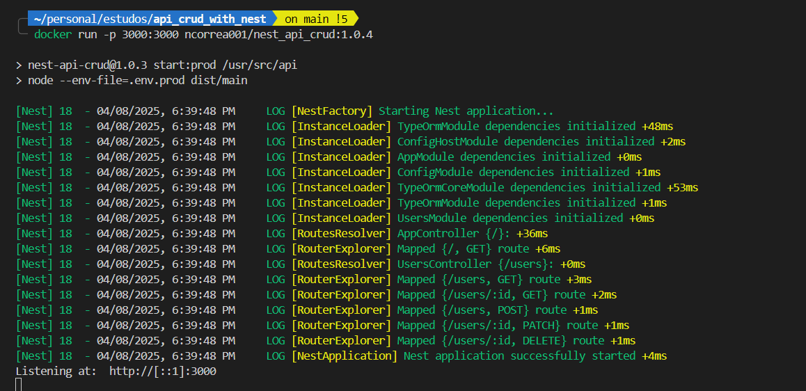
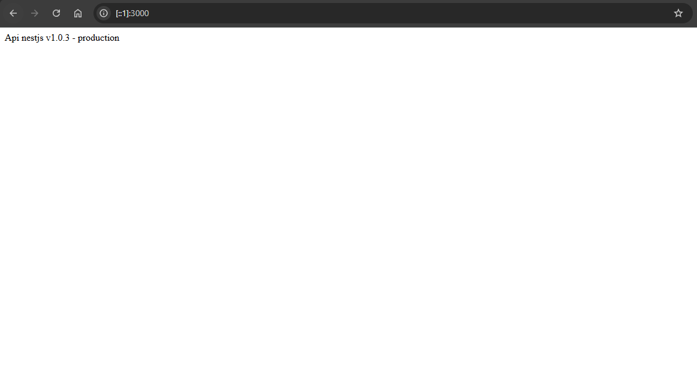
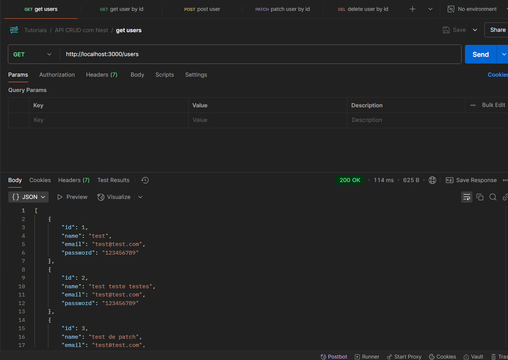

## Description

This project is an example of an API CRUD with Nest.

[Nest](https://github.com/nestjs/nest) is a progressive Node Framework built on top of Node and Express with native support for Typescript.

## Project setup

1. To run the project you will need to install [Docker](https://docs.docker.com/get-started/get-docker/).
2. After installing docker, from a terminal or console, you need to download the image for this project, currently hosted on my Docker Hub account: [ncorrea001](https://hub.docker.com/repositories/ncorrea001). Run the following:

```bash
docker pull ncorrea001/nest_api_crud:1.0.4
```
The command above downloads the image from Docker Hub to your hard disk.

3. Now you need to run the image:

```bash
docker run -p 3000:3000 ncorrea001/nest_api_crud:1.0.4
```
The command above is gonna create a new container to run the image that you downloaded before, and is gonna define the port 3000 for the container to run.

4. If you've followed the commands above you should already be able to see the logs from the server, like this:



Notice the last line saying the server is listening on [http://[::1]:3000](http://[::1]:3000). If you type or click that address/link on a browser you will see as follows:



If you have a tool to develop and test APIs like Postman you will see the Rest API Methods:
- Get all users /users
- Get user by id /users/:id
- Post new user /users
- Patch existing user by id /users/:id
- Delete existing user by id /users/:id



----------------------------------------

That's it.

The idea of this project was to learn how to develop the CRUD operations on a Nest application (new Node Framework) and then launch it from inside a docker container.

In this project I also explored the new Node Package Manager, called [Performant Node Package Managment](https://pnpm.io), that as the name suggests is faster and more performatic then Node's default package manager NPM.

